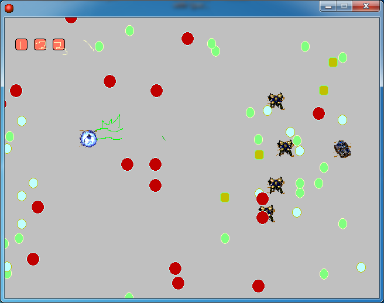

# 아콘의모험

스타크래프트의 아콘을 주인공으로, 드라군 부대가 쏟아내는 탄막을 피해 나아가는 게임이다. 스테이지와 보스전, 사운드가 들어 있다.

  

## 플레이 방법

Releases에서 받아 실행하면 된다.

방향키로 아콘을 움직이고 스페이스를 누르고 있으면 멈춘다. 드라군이 쏘는 탄에 닿으면 죽는다. 스테이지 하나를 지나면 보스전이 세 번 이어진다.

난이도가 인내심을 시험하는 수준이라 사망 화면에서 1~4 키를 누르면 원하는 구간으로 건너뛸 수 있게 해뒀다. 1은 스테이지, 2부터 4는 각 보스전이다.

## 구현 원리

룸 다섯 개로 전체 흐름을 짰다. 스테이지 하나, 사망 화면 하나, 보스전 세 개다. 치트 키는 사망 화면에 놓인 오브젝트에 1~4 키 이벤트를 걸고 각각 다른 룸으로 보내는 액션을 붙인 것이다. 진행 상태를 따로 저장하지 않고 룸 이동만으로 처리했다.

## 파일

| 경로 | 내용 |
|---|---|
| `source/archon-adventure.gmk` | 원본 프로젝트 파일 |
| `source/split/` | GmkSplitter로 분해한 텍스트 트리 |
| `docs/screenshots/` | 스크린샷 |
| Releases | 배포용 파일 |

## 라이선스

CC BY-NC-ND 4.0 라이선스다. 출처를 밝히면 비상업 용도로 그대로 공유할 수 있고, 수정본 배포와 상업적 이용은 금지한다. 함께 들어 있는 것 중 다른 사람이 만든 라이브러리와 그림·소리·맵은 각자의 권리를 따른다. 자세한 내용은 [LICENSE](LICENSE) 에 있다.
